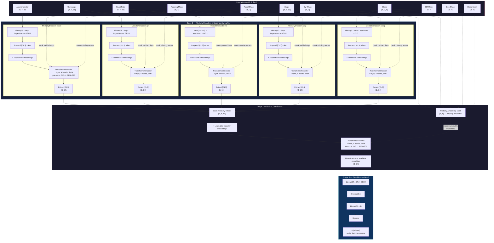

# Multimodal Relapse Prediction

Multimodal transformer fusion model for non-psychotic relapse detection from wearable sensor data (Track 1). Binary per-day classification (relapse vs. stable) for 9 patients using 5 sensor modalities under Leave-One-Subject-Out (LOSO) cross-validation.

## Model Architecture

**~300K parameters** with default hyperparameters (d_model=64, 4 heads, 1 encoder layer, 1 fusion layer).
