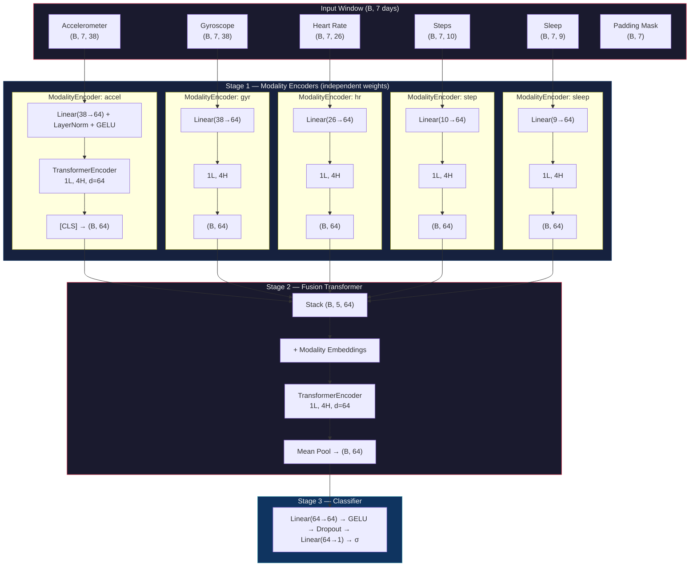

# Multimodal Relapse Prediction

Non-psychotic relapse detection from wearable sensor data. Binary per-day classification for 9 psychiatric patients using 5 sensor modalities (accelerometer, gyroscope, heart rate, steps, sleep) under Leave-One-Subject-Out cross-validation.

**Key result: 0.845 AUROC** with a single transformer using focal loss (d=1024, 3 layers, 4 heads, 9-fold LOSO).

## Architecture

Two-stage multimodal transformer: independent per-modality encoders → cross-modal fusion → binary classification.


```mermaid
graph TB
    subgraph Input["Input Window (B, 7 days)"]
        A1["Accelerometer<br/>(B, 7, 38)"]
        A2["Gyroscope<br/>(B, 7, 38)"]
        A3["Heart Rate<br/>(B, 7, 26)"]
        A4["Steps<br/>(B, 7, 10)"]
        A5["Sleep<br/>(B, 7, 9)"]
        PM["Padding Mask<br/>(B, 7)"]
    end

    subgraph Stage1["Stage 1 — Modality Encoders (independent weights)"]
        subgraph ME1["ModalityEncoder: accel"]
            P1["Linear(38→64) + LayerNorm + GELU"]
            TE1["TransformerEncoder<br/>1L, 4H, d=64"]
            C1["[CLS] → (B, 64)"]
            P1 --> TE1 --> C1
        end
        subgraph ME2["ModalityEncoder: gyr"]
            P2["Linear(38→64)"] --> TE2["1L, 4H"] --> C2["(B, 64)"]
        end
        subgraph ME3["ModalityEncoder: hr"]
            P3["Linear(26→64)"] --> TE3["1L, 4H"] --> C3["(B, 64)"]
        end
        subgraph ME4["ModalityEncoder: step"]
            P4["Linear(10→64)"] --> TE4["1L, 4H"] --> C4["(B, 64)"]
        end
        subgraph ME5["ModalityEncoder: sleep"]
            P5["Linear(9→64)"] --> TE5["1L, 4H"] --> C5["(B, 64)"]
        end
    end

    subgraph Stage2["Stage 2 — Fusion Transformer"]
        STACK["Stack (B, 5, 64)"]
        MEMB["+ Modality Embeddings"]
        FTE["TransformerEncoder<br/>1L, 4H, d=64"]
        POOL["Mean Pool → (B, 64)"]
        STACK --> MEMB --> FTE --> POOL
    end

    subgraph Stage3["Stage 3 — Classifier"]
        FC["Linear(64→64) → GELU → Dropout → Linear(64→1) → σ"]
    end

    A1 --> P1; A2 --> P2; A3 --> P3; A4 --> P4; A5 --> P5
    C1 --> STACK; C2 --> STACK; C3 --> STACK; C4 --> STACK; C5 --> STACK
    POOL --> FC

    style Input fill:#1a1a2e,stroke:#e94560,color:#eee
    style Stage1 fill:#16213e,stroke:#0f3460,color:#eee
    style Stage2 fill:#1a1a2e,stroke:#e94560,color:#eee
    style Stage3 fill:#0f3460,stroke:#53a8b6,color:#eee
```

~300K parameters (d_model=64, default config). Headline result uses d_model=1024 (~19M params).

## Setup

```bash
python -m venv env
source env/bin/activate
pip install -r requirements.txt
```

## Data

Expects patient data in `data/original/track1/`:

```
track1/
  demographics.csv
  P{1-9}/
    {train,val,test}_{0,1,2}/
      gyr.parquet      # Gyroscope (20 Hz)
      hrm.parquet      # Heart rate (5 Hz)
      linacc.parquet   # Linear accelerometer (20 Hz)
      step.parquet     # Step count (per minute)
      sleep.parquet    # Sleep episodes
      relapses.csv     # Relapse labels
```

## Running Experiments

```bash
# Feature engineering notebook
jupyter notebook notebooks/main.ipynb

# Preprocess for experiment framework
python scripts/preprocess_data.py

# Run experiment locally
bash scripts/run.sh -n ablation_focal

# Submit to SLURM
bash scripts/submit_slurm.sh -n ablation_focal
```

See [EXPERIMENTS.md](EXPERIMENTS.md) for full experiment catalog and reproduction instructions.

## Repository Structure

```
├── EXPERIMENTS.md              # Experiment catalog with results
├── configs/                    # ~43 experiment configs (see configs/README.md)
├── docs/
│   ├── TASK_ARCHIVE.md         # Development log
│   └── results/                # Auto-generated per-experiment docs + summary
├── figures/                    # Exported plots
├── notebooks/
│   ├── main.ipynb              # Feature engineering + modeling
│   └── README.md               # LaTeX/TinyTeX setup
├── scripts/                    # Run/submit/preprocess/verify scripts
└── src/
    ├── models/                 # Transformer variants (v1–v4)
    ├── losses/                 # Focal loss
    ├── data_loader.py          # Raw sensor data loading
    ├── feature_extractor.py    # 21 per-day scalar features
    ├── preprocess_loso.py      # LOSO fold generation
    ├── train.py                # Training loop
    ├── ablation.py             # Ablation study runner
    └── experiment.py           # Single experiment runner
```

## Citation

```bibtex
@misc{relapse-prediction-2025,
  title={Multimodal Relapse Prediction from Wearable Sensor Data},
  year={2025}
}
```
